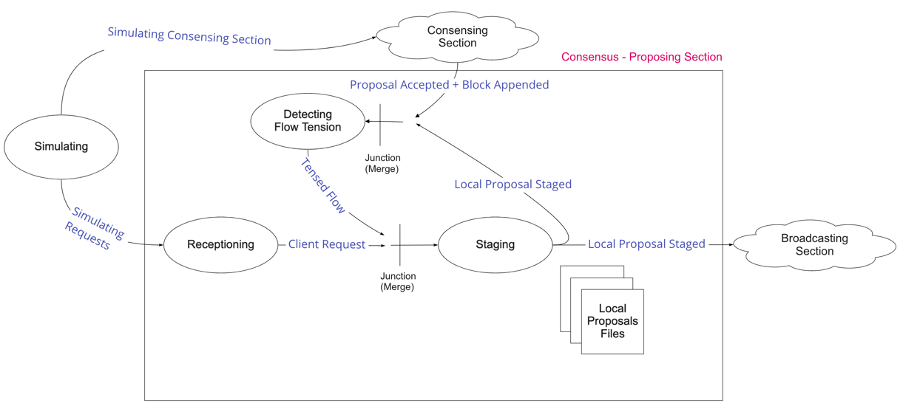

/ [Consensus](https://github.com/dolla-consortium/consensus) / [Proposing](#proposing-section)
# Proposing Section

- [Section Overview](#section-overview)
- [DevOps](#devops)
- [Development Tasks (Mac OSX)](#development-tasks-mac-osx)

# Section Overview

As Consensus Flow Entry Point, "Proposing" means taking the responsibility of
**receptioning** requests from customers and consortium and **packaging** them into local proposals.
Each of these local proposals are proposed for transactions into the consortium block stream.

A **Section** is a meaningful Set of Pipelines and Junctions put together.

>  Worth Mentioning : [Packaging](/packages/packaging/) is the core of this section.  
> It's a good example of Pipeline Implementation in Haskell.

- [Receptioning](/packages/receptioning) : Client/Server for collecting requests presenting them for being packaged into a proposal.
- [Packaging](/packages/packaging/) : Produce Local Proposal Files with the following properties
- [Detecting Flow Tension](/packages/detecting-tension) : Detect if the local proposal flow is tensed, meaning if the consensus has consumed more local proposals than being staged.
  - `Proposals are never empty`
  - `Proposals file size < configurable size limit`
  - Filename - `x.proposal` with `x` the offset of proposal produced
- [Simulating](/packages/simulating) : Simulate the proposing input streams
  - Send dummy requests to `Receptioning` and simulate the downstream consumption of local proposal.
  - 2 modes are available :
    - **Overflowing** : Sending more requests than the consortium can consume
    - **UnderSupplying** : Sending less request than the consortium can consume

# DevOps

[Zeus](/packages/zeus) : Local Deployment Tool
- Running only the proposing section in a simulated and local environment.
- Configuring Microservices via an interactive CLI :
  - Mode of simulation (Overflowing/UnderSupplying)
  - Proposal size limit

# Development Tasks (Mac OSX)

- [Environment Setup](documentation/development-task.md#environment-setup)
- [Run the tests](documentation/development-task.md#run-the-tests)
- [Install the executables](documentation/development-task.md#install-the-executables)
- [Running a Simulated Consensus Proposing](documentation/development-task.md#running-a-simulated-consensus-proposing)