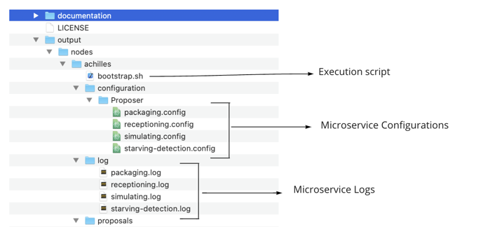
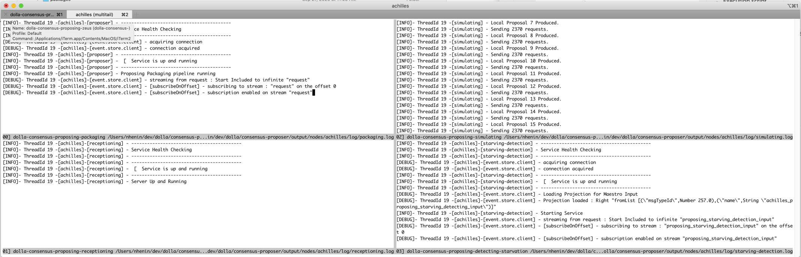
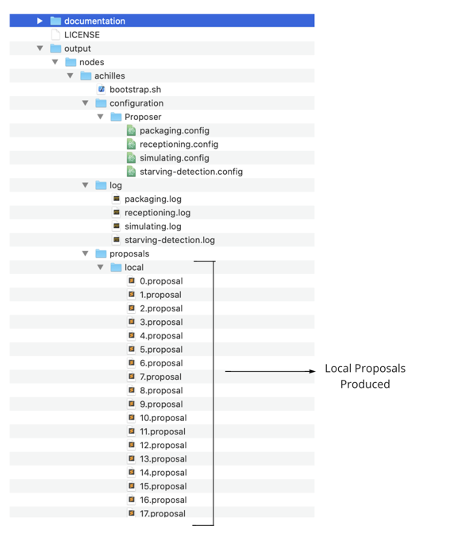

# Development Tasks (Mac OSX)

- [Environment Setup](#environment-setup)
- [Run the tests](#run-the-tests)
- [Install the executables](#install-the-executables)
- [Running a Simulated Consensus Proposing](#running-a-simulated-consensus-proposing)
 
# Environment Setup

- Install [Docker For Mac](https://docs.docker.com/docker-for-mac/install/)
- Install [Multitail](http://macappstore.org/multitail/)
- Install the Haskell Platform For Mac (GHC, Cabal build system, [Stack tool](https://docs.haskellstack.org/en/stable/README/), ...)
```shell
curl --proto '=https' --tlsv1.2 -sSf https://get-ghcup.haskell.org | sh
```
- IDE suggestion :
  - [Intellij IDEA Community Edition](https://www.jetbrains.com/idea/download/download-thanks.html?platform=mac&code=IIC)
  - [Intellij Haskell Plugin](https://plugins.jetbrains.com/plugin/8258-intellij-haskell)

# Run the tests
- Manual
```shell
stack test
```
- Automatic (will rebuild and test every time a file changes)
```shell
stack test --fast --file-watch
```

# Install the executables

- Manual
```shell
stack install
```
- Automatic (will rebuild and install every time a file changes)
```shell
stack install --fast --file-watch
```
You should see something similar at the end :
```shell
Copied executables to /Users/nhenin/.local/bin:
- dolla-consensus-proposing-detecting-tension
- dolla-consensus-proposing-staging
- dolla-consensus-proposing-receptioning
- dolla-consensus-proposing-simulating
- dolla-consensus-proposing-zeus
```

# Running a Simulated Consensus Proposing

- Install the executables (see previous section)
- Make sure you are at the root of the project
- Execute Proposing Zeus

```shell
dolla-consensus-proposing-zeus
```
N.B : If you run it for the first time , it will install the eventstore docker image (eventstore/eventstore:release-5.0.6)
```shell
WARNING: Some next steps will your ADMIN PASSWORD
```
Next Steps :
- Interactivity with the CLI for getting the desired parameters
- Start the Event Store docker container
- Configure the EventStore for running the consensus properly (**REQUIRE ADMIN PASSWORD**)
- Run the proposing executables in another tab


Below, an example about how to run Zeus
```shell
➜  consensus-proposing git:(master) : dolla-consensus-proposing-zeus
################################################
|| Welcome on Zeus for the Proposing Section  ||
################################################
   1- Run/Re-Run the proposing section locally
   2- Stop the proposing section locally
   3- Quit Zeus

> please choose an action (provide the index) : [1]
-------------------------------------------
 - Delete Local Proposing Pipeline Data
-------------------------------------------
>| reset the Event Store data for achilles
docker rm -f consensus-achilles &>/dev/null
>| Deleting proposals recorded on the file system
rm -rf /Users/nhenin/dev/dolla/consensus-proposer/output/*
------------------------------
* Starting Local Proposer *
------------------------------
Enter the proposal size limit size in kilobytes ? [max 10 mb] < : 1000
> Proposal limit size =  1.0000 mb
   1- Overflowing the pipeline with request
   2- Undersupplying the pipeline

> please choose an option for simulating client requests (provide the index) : [1] 2
>| starting containers for achilles
docker run --name consensus-achilles -dit -p 2113:2113 -p 1114:1113 eventstore/eventstore  1>/dev/null
>| Re-configure the Event Store for achilles
sudo curl -i -X POST 'http://127.0.0.1:2113/projection/%24by_category/command/enable' -H 'accept:application/json' -H 'Content-Length:0'  -u admin:changeit &>/dev/null
Password:******
>| Killing proposer microservices badly closed (issue with multitail...)
kill $(ps -A | grep -v "dolla-consensus-proposing-zeus" | grep dolla-consensus-proposing- | awk '{print $1}')  &>/dev/null
>| Closing tabs opened for running local nodes...
sudo kill $(ps -A | grep "multitail -s 2 -l" | awk '{print $1}')  &>/dev/null
chmod 777 /Users/nhenin/dev/dolla/consensus-proposer/output/nodes/achilles/bootstrap.sh
osascript -e 'tell application "iTerm" to activate' -e 'tell application "System Events" to tell process "iTerm" to keystroke "t" using command down' -e 'tell application "System Events" to tell process "iTerm" to keystroke " /Users/nhenin/dev/dolla/consensus-proposer/output/nodes/achilles/bootstrap.sh ; exit; "' -e 'tell application "System Events" to tell process "iTerm" to key code 52'
```
At that moment, the node (named `Achilles`) is sufficiently configured for running the proposing section, the following arborescence has been created :



[Zeus](#tooling) will then launch all the proposing section microservices into a new tab (each one in one windows) :



You can now see the local proposal being produced in `output/nodes/achilles/proposals/local/` :



go back to Zeus if you want to stop the Proposing section. (choice 2)