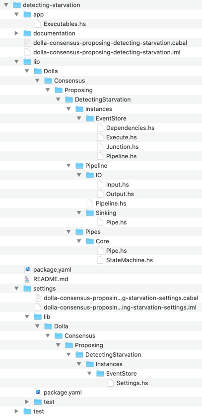

/ [Consensus](https://github.com/dolla-consortium/consensus) / [Proposing](https://github.com/dolla-consortium/consensus-proposing) / Detecting Starvation
# Detecting Starvation

- [Overview](#overview)
- [Project Tree](#project-tree)

# Overview

 

# Project Tree

### 1. Pipeline

`DetectingStarvation` is a simple ***Pipeline***
- a persisted input stream : [Input.hs](lib/Dolla/Consensus/Proposing/DetectingStarvation/Pipeline/IO/Input.hs)
- a pipeline [Pipeline.hs](lib/Dolla/Consensus/Proposing/DetectingStarvation/Pipeline/Pipeline.hs)
  - Sourcing initial inputs : `stream infinitely inputLog`
  - Core [Pipe.hs](lib/Dolla/Consensus/Proposing/DetectingStarvation/Pipes/Core/Pipe.hs)
    - using [StateMachine.hs](lib/Dolla/Consensus/Proposing/DetectingStarvation/Pipes/Core/StateMachine.hs)
    - No Welding : We are using the Input/Output of the Pipeline itself (only 1 pipe)
  - Sinking final outputs : `sinking outputLog`
- a persisted output stream : [Output.hs](lib/Dolla/Consensus/Proposing/DetectingStarvation/Pipeline/IO/Output.hs)

### 3. Instances

`DetectingStarvation` is Polymorphic by the Log Engine used

You'll find in this folder a concrete version of [Pipeline.hs](lib/Dolla/Consensus/Proposing/DetectingStarvation/Instances/EventStore/Pipeline.hs) over the event store

`DetectingStarvation` has some DevOps features as well

- [Settings.hs](settings/lib/Dolla/Consensus/Proposing/DetectingStarvation/Instances/EventStore/Settings.hs)  always into a separated project `xxxx-packaging-settings` for deployment purposes in Zeus
- [Dependencies.hs](lib/Dolla/Consensus/Proposing/DetectingStarvation/Instances/EventStore/Dependencies.hs) are derived from Settings if sub-dependencies are all Healthy

[Execute.hs](lib/Dolla/Consensus/Proposing/DetectingStarvation/Instances/EventStore/Execute.hs) is an **Instance** of the Pipeline
- Perform the HealhtChecks to obtain the pipeline dependencies
- Execute the pipeline + load the [junctions](#junction) in the EventStore Microservice
- Put the Microservice back in HealthCheck mode if any Exception bubbles up in the pipeline during execution.

**N.B** : Microservice configuration and Deployment Logic (Locally/Simulated/Production etc...) are defined in the package [Zeus](../zeus/)

# Pipeline
## Junction

A Junction (Merger) is
   - a set of persisted input streams
   - a nondeterministic logic for merging these input streams
   - a persisted output stream (input of a pipeline)

The persisted input stream is the junction of 2 upstreams pipelines
- Consening :
  - Local Proposal Consumed
  - Local Proposal Asked
- [Packaging](../packaging/README.md) transmitting Local Proposal

We are using the "User Defined Projections" feature from the EventStore to implement this junction :
 - javaScript snippets
 - loaded in the event store microservice directly
 - more details : https://eventstore.org/docs/projections/api/index.html

These features were used to move quicker on the proof of concept. We'll eventually implement our own soon.

> Defined in [Junction.hs](lib/Dolla/Consensus/Proposing/Packaging/Instances/EventStore/Dolla/Junction.hs)

> Executed in [Execute.hs](lib/Dolla/Consensus/Proposing/Packaging/Instances/EventStore/Dolla/Execute.hs)

## IOs