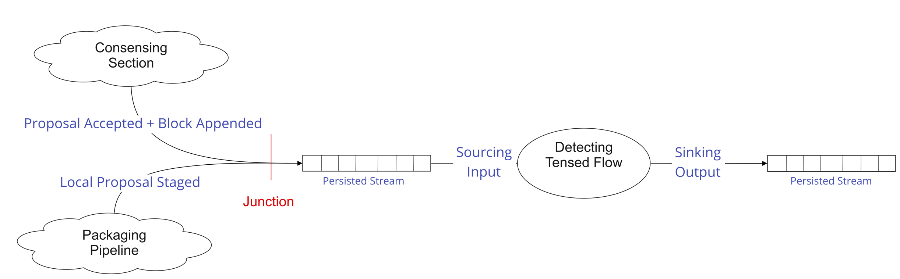

/ [Consensus](https://github.com/dolla-consortium/consensus) / [Proposing](https://github.com/dolla-consortium/consensus-proposing) / Detecting Tension
# Detecting Tension

- [Overview](#overview)
- [Project Tree](#project-tree)
- [Pipeline](#pipeline)
  - [Junction](#junction)
  - [IO](#ios)
    - [Input/Events](#inputevents)
    - [Output/Events](#outputevents)
- [Pipes](#pipes)
  - [Detecting Tensed Flow](#detecting-tensed-flow)

# Overview
`Detecting Tension` is responsible for detecting when the local proposal flow is tensed, meaning if the consensus has consumed more local proposals than being staged.

 

# Project Tree
<div>
### 1. Pipeline

`DetectingTension` is a simple ***Pipeline***
- a persisted input stream : [Input.hs](library/Dolla/Consensus/Proposing/DetectingTension/Pipeline/IO/Input.hs)
- a line of Pipes Welded together in  [Pipeline.hs](library/Dolla/Consensus/Proposing/DetectingTension/Pipeline/Pipeline.hs)
  - Sourcing initial inputs : `stream infinitely inputLog`
  - `DetectingTensedFlow` : A pipe that detects a tensed flow in [Pipe.hs](library/Dolla/Consensus/Proposing/DetectingTension/Pipes/DetectingTensedFlow/Pipe.hs) using [StateMachine.hs](library/Dolla/Consensus/Proposing/DetectingTension/Pipes/DetectingTensedFlow/StateMachine.hs)
  - A Welding : Adapting IOs between pipes
  - Sinking final outputs : `sinking outputLog`
- a persisted output stream : [Output.hs](library/Dolla/Consensus/Proposing/DetectingTension/Pipeline/IO/Output.hs)

From A CQRS point of view, `DetectingTension` is a projection. It projects outputs from events previously recorded in the system.

### 2. Execution Environment

`DetectingTension` is Polymorphic by the Log Engine used.

You'll find in this folder a concrete pipeline version in [Pipeline.hs](library/Dolla/Consensus/Proposing/DetectingTension/Execution/Environment/EventStore/Pipeline.hs) over the event store

### 3. Executable

`DetectingTension` has some DevOps features as well

- [Settings.hs](settings/library/Dolla/Consensus/Proposing/DetectingTension/Execution/Environment/EventStore/Settings.hs)  always into a separated project `xxxx-detecting-tension-settings` for deployment purposes in Zeus
- [Dependencies.hs](library/Dolla/Consensus/Proposing/DetectingTension/Execution/Environment/EventStore/Dependencies.hs) are derived from Settings if sub-dependencies are all Healthy

[Executable.hs](executables/Executables.hs)
- Perform the HealhtChecks to obtain the pipeline dependencies
- Execute the pipeline + load the [junctions](#junction) in the EventStore Microservice
- Put the Microservice back in HealthCheck mode if any Exception bubbles up in the pipeline during execution.

**N.B** : Microservice configuration and Deployment (Locally/Simulated/Production etc...) are defined in the package [Zeus](../zeus/)

</div>

# Pipeline
## Junction

A Junction (Merger) is
   - a set of persisted input streams
   - a nondeterministic logic for merging these input streams
   - a persisted output stream (input of a pipeline)

The persisted input stream is the junction of 2 upstreams pipelines
- Consening :
  - `Local Proposal Accepted`
  - `Consensus Reached`
- [Staging](../staging/README.md) with `Local Proposal Staged`

We are using the "User Defined Projections" EventStore feature to implement this junction
 - javaScript snippets
 - loaded in the event store microservice directly
 - more details : https://eventstore.org/docs/projections/api/index.html

> Defined in [Junction.hs](library/Dolla/Consensus/Proposing/DetectingTension/Execution/Environment/EventStore/Junction.hs)

> Executed in [Executable.hs](executables/Executables.hs)
## IOs
### Input/Events

The pipeline does not execute commands but just `fold` previous events recorded into the system to provide insights to the downstream flow.  
In this situation, it will provide information for optimising the flow
management (purging requests accumulated in the [Staging](../staging/README.md) pipeline)

```haskell
data  Input
  = LocalProposalAccepted -- ^ local proposal has been accepted by the consortium
  | LocalProposalStaged -- ^ local proposal has been staged by the local staging pipeline
  | ConsensusReached -- ^ A global consensus has been reached for the proposals of the current block,
                     --   All the proposal accepted will be consumed.
```
> Defined in [Input.hs](library/Dolla/Consensus/Proposing/DetectingTension/Pipeline/IO/Input.hs)

### Output/Events

The pipeline will output
```haskell
data Output = Tensed deriving (Eq, Show
```

This output will be sinked and used in the [Staging](../staging/README.md) junction pipeline.

# Pipes
## Detecting Tensed Flow
### Problem

Detect if the local proposal flow is tensed, meaning if the consensus has consumed more local proposals than being staged.

### Approach

We'll transpose our terminology from the specific consensus domain to a more generic one
```haskell
instance Weldable DetectingTension.Input DetectingTensedFlow.Input where
  weld
    = \case
      DetectingTension.LocalProposalAccepted  -> DetectingTensedFlow.Released
      DetectingTension.LocalProposalStaged    -> DetectingTensedFlow.Staged
      DetectingTension.ConsensusReached       -> DetectingTensedFlow.Pulled
```

A flow is tensed when
- all the items staged have been released and pulled
- we are pulling on `items staged - items release == 0`

> Implemented in [Pipe.hs](library/Dolla/Consensus/Proposing/DetectingTension/Pipes/DetectingTensedFlow/Pipe.hs) and [StateMachine.hs](library/Dolla/Consensus/Proposing/DetectingTension/Pipes/DetectingTensedFlow/StateMachine.hs)

> Tested in [StateMachineSpec.hs](test/Dolla/Consensus/Proposing/DetectingTension/Pipes/DetectingTensedFlow/StateMachineSpec.hs)
