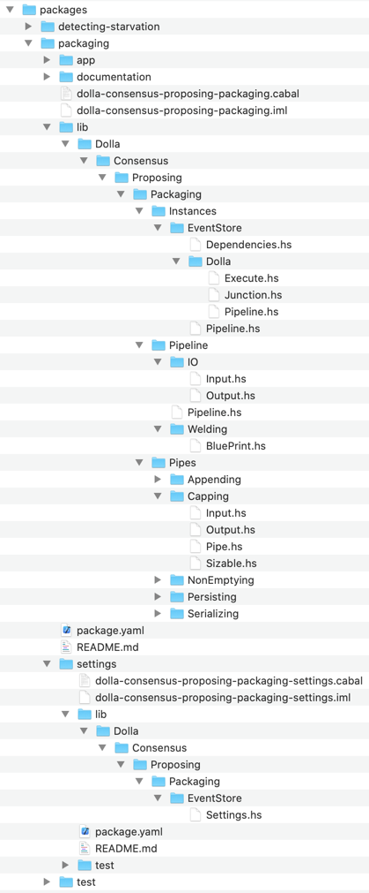

/ [Consensus](https://github.com/dolla-consortium/consensus) / [Proposing](https://github.com/dolla-consortium/consensus-proposing) / [Packaging](#packaging-pipeline)
# Packaging Pipeline
- [Overview](#overview)
- [Pipeline](#pipeline)
  - [IOs](#ios)
    - [Input/Commands](#inputcommands)
    - [Output/Events](#outputevents)
  - [Pipe recipe](#pipe-recipe)
  - [Polymorphism](#polymorphism)
- [Pipes](#pipes)
  - [Serializing](#serializing)
  - [NonEmptying](#nonemptying)
  - [Capping](#capping)
  - [Persisting](#persisting)


# Overview

<div>
### Pipeline Folder

`Packaging` is a ***Pipeline***
- a persisted input stream : [Input.hs](lib/Dolla/Consensus/Proposing/Packaging/Pipeline/IO/Input.hs)
- a line of Pipes Welded together
  - composition of **deterministic** *Pipes*
  - Welding : Adapting IOs between pipes

  ```
  serializing .~> nonEmptying .~> capping .~> persisting 
  ```
- a persisted output stream : [Output.hs](lib/Dolla/Consensus/Proposing/Packaging/Pipeline/IO/Output.hs)

### Pipes Folder
The pipeline is using Pipes `Serializing, nonEmptying, capping, persisting`, meaning each of them has
- An Input Stream
- A Stream Processing
- An Output Stream

### Instance Folder

`Packaging` could be Executed into different environment defined by the type Log Engine used and the business logic running on top of the consensus layer.
So far we have only one environment which the EventStore and our own Dolla Business Logic

You'll find :

- [Settings.hs](settings/lib/Dolla/Consensus/Proposing/Packaging/EventStore/Settings.hs)  always into a separated project `xxxx-packaging-settings` for deployment purposes in Zeus
- [Dependencies.hs](lib/Dolla/Consensus/Proposing/Packaging/Execution/EventStore/Dependencies.hs) are derived from Settings if sub-dependencies are all Healthy
- [Execute.hs](lib/Dolla/Consensus/Proposing/Packaging/Execution/EventStore/Dolla/Execute.hs)
    - Perform the HealhtChecks to obtain the pipeline dependencies
    - Execute the pipeline
    - Put the Microservice back in HealthCheck mode if any Exception bubbles up in the pipeline during execution.

N.B : Microservice configuration and Deployment Logic are defined in Zeus : [Pipeline.hs](../zeus/lib/Dolla/Consensus/Proposing/Zeus/Local/Pipeline.hs)
</div>

# Pipeline
## IOs
### Input/Commands

> Defined in [Input.hs](lib/Dolla/Consensus/Proposing/Packaging/Pipeline/IO/Input.hs)

The persisted input stream is the junction of 2 upstreams pipelines
- [Receptioning](../receptioning/README.md) providing collected requests
- [Detecting-Starvation](../detecting-starvation/README.md) transmitting Local-Proposal-Starvation Notifications

#### 1. Package request

Executing that command means
- Accumulate each request into a temporary file.

```
FileName : x.tmp with x the offset of local proposal produced
```

- Detect when the temporary file is full

```
Current Size + new request size < configurable size limit
```
- Convert this temporary file into a proposal file
```
x.tmp -> x.proposal
```
- Redirect the stream into a new Temporary File : `(x+1).tmp`
- Notify the downstream Broadcasting Section that a new local proposal is available.

#### 2. ForceProposalProduction

Executing that command means :
- Converting the temporary file into a proposal file if requests are accumulated.

### Output/Events

> Defined [Output.hs](lib/Dolla/Consensus/Proposing/Packaging/Pipeline/IO/Output.hs)

Packaging produces
- A Notification : `LocalProposalProduced {localOffset :: Offset}`
- a File `{localOffset}.proposal` containing requests with
```
0 < Size <= Size Limit
```
## Pipe recipe

To produce the expected pipeline output , we are combining different pipes all together by
- A simple function composition (.)
- A welding : `map` to adapt `Output Pipe(x)`  with `Input Pipe(x+1)`

The `Packaging` pipe recipe is
```haskell
  stream infinitely inputLog
     ~> serializing
    .~> nonEmptying
    .~> capping proposalSizeLimit
    .~> persisting proposalRootFolder
    .~> notifying outputLog
```
> Defined in [Generic.hs](lib/Dolla/Consensus/Proposing/Packaging/Pipeline/Pipeline.hs)

> The welding between each pipe is defined in [/Welding/BluePrint.hs](lib/Dolla/Consensus/Proposing/Packaging/Pipeline/Welding/BluePrint.hs)

The pipe recipe goals are
### 1. Size properly the proposals
```
0 < Size <= Size Limit
```
Under the responsibility of
- [`NonEmptying`](#nonemptying) Pipe
- [`Capping`](#capping) Pipe

### 2. Convert the temporary file to a proposal file.
Under the responsibility of
- [`Persisting`](#persisting) Pipe

N.B : [`Serializing`](#serializing) will be removed eventually. We'll evaluate this when addressing data compression.

## Polymorphism

The Generic Pipeline is agnostic from
- The log Engine used to retrieve Input and persist Output
- The structure of the request manipulated

To execute `Packaging`, we need to turn [Generic.hs](lib/Dolla/Consensus/Proposing/Packaging/Pipeline/Pipeline.hs) into a concrete Pipeline
- [OverEventStore.hs](lib/Dolla/Consensus/Proposing/Packaging/Pipeline/Over/EventStore/Pipeline.hs) : EventStore is the log Engine used (Polymorphism reduced)
- [OverEventStoreAndDolla.hs](lib/Dolla/Consensus/Proposing/Packaging/Pipeline/Over/EventStore/Dolla/Pipeline.hs) : We are using Dummy Dolla Requests with the EventStore (Concrete Pipeline)

# Pipes
## Serializing

> Defined in [Pipe.hs](lib/Dolla/Consensus/Proposing/Packaging/Pipes/Serializing/Pipe.hs)

Just Transform `request` in `SerializedRequest`

```haskell
newtype SerializedRequest = SerializedRequest [Word8] deriving (Eq,Show)
```

> N.B : `serializing` will be removed eventually. We'll address it when we'll add the request compression features.

## NonEmptying

### Problem

Remembering the initial input of the section
```haskell
data Input request
  = ForceProposalProduction -- ^ ask to "Packaging Pipeline" to flush all the requests currently collected
  | Package request -- ^ ask to to "Packaging Pipeline" to package the request into a proposal according
                    -- some properties (see README.md)
  deriving (Eq,Show)


```
It's totally natural to receive multiple `ForceProposalProduction` commands consecutively, E.g
- No Requests while many blocks are appended consecutively
- Etc...

Forcing the production of empty proposal adds no value in our domain and provokes an accidental complexity downstream if not managed.  
Therefore, we want to
- Remove the consecutive `ForceProposalProduction` commands from our input stream.
- Never start downstream processing with a `ForceProposalProduction`

Said differently, we want to get the following property
```
0 < Proposal File Size 
```

### Approach

With the following Natural Transformation
``` haskell
Packaging.Input request ~> Maybe request
```
We want the following stream property
- Never start by `Nothing`
- Never 2 consecutive `Nothing`

E.g - We want the following transformation
``` haskell
[Nothing, Just r1, Just r2, Nothing, Nothing, Nothing] -> [Just r1, Just r2, Nothing]
```
> Implemented in [Pipe.hs](lib/Dolla/Consensus/Proposing/Packaging/Pipes/NonEmptying/Pipe.hs)

> Tested in [PipeSpec.hs](test/Dolla/Consensus/Proposing/Packaging/Pipes/NonEmptying/PipeSpec.hs)

## Capping

### Problem

We can't broadcast proposal files with unlimited memory size. We want the following property

```
Proposal File Size <= Size Limit
```

`Capping` is welded after `NonEmptying`, combining the 2 pipes will give the following property
```
0 < Proposal File Size <= Size Limit
```


### Approach

To increase the expressivity of our previous domain we are doing the following natural transformation
```haskell
instance Weldable (NonEmptying.Output request) (Capping.Input request) where
  weld
    = \case
      Nothing  -> Capping.AskForACut
      Just request -> Capping.Add request
```
With the Following Output in [Output.hs](lib/Dolla/Consensus/Proposing/Packaging/Pipes/Capping/Output.hs)
```haskell
data Output request
  = Cut
  | Added request
  deriving (Show,Eq)
```
the polymorphism on `request` is reduced with the following type Class

```haskell
class Sizable a where
  getMemorySize :: a -> Byte
  
capping
  :: ( S.MonadAsync m
     , Sizable item)
  => Byte -- ^ proposalSizeLimit
  -> S.SerialT m (Input item)
  -> S.SerialT m (Output item)
````
We are cutting the consecutiveness of `Added request` events if the cumulative memory size of requests is > a size limit given.
By "cutting", we mean adding a `Cut` in between 2 `Added request` events.

Using a `Fold executed with a postscan` with the following State Machine


> Implemented in [Pipe.hs](lib/Dolla/Consensus/Proposing/Packaging/Pipes/Capping/Pipe.hs)

> Tested in [PipeSpec.hs](test/Dolla/Consensus/Proposing/Packaging/Pipes/Capping/PipeSpec.hs)

## Persisting

### Prerequesites
This pipe prerequesites the following properties on its stream input
```
0 < Proposal File Size <= Size Limit
```
### Input/Output
```haskell
data Input request
  = CommitProposal
  | Persist request
  deriving (Show,Eq,Functor)
  
newtype Output 
  = LocalProposalPersisted {proposalId :: Offset} 
  deriving (Show,Eq)
```
### Processing

Using Streamly FileSystem primitives

- Create a temporary file : `x.tmp`
- Persist request
- When receiving `CommitProposal`
  - Convert `x.tmp` into `x.proposal`
  - produce `LocalProposalPersisted x`
  - `x = x + 1`

> Implemented in [Pipe.hs](lib/Dolla/Consensus/Proposing/Packaging/Pipes/Persisting/Pipe.hs)

> Integration Test in [PipeSpec.hs](test/Dolla/Consensus/Proposing/Packaging/Pipes/Persisting/PipeSpec.hs)