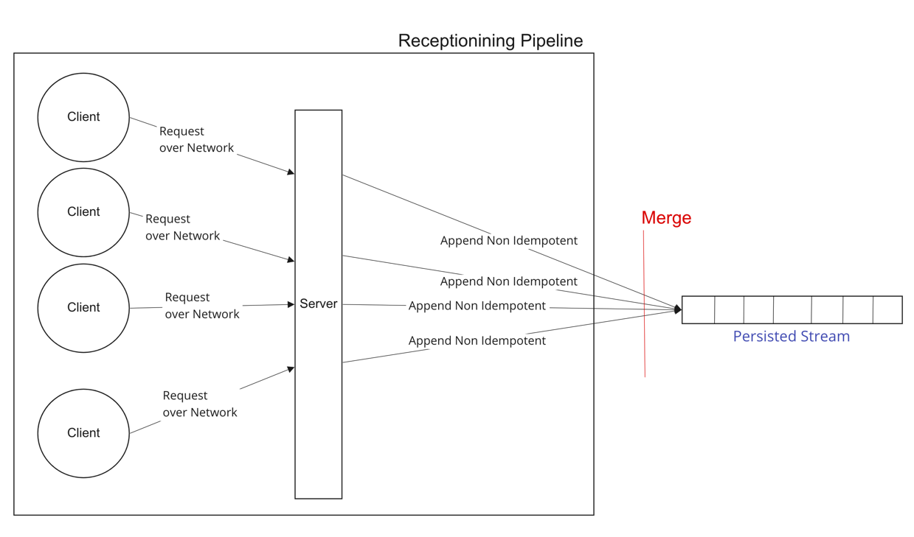
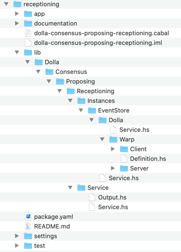

/ [Consensus](https://github.com/dolla-consortium/consensus) / [Proposing](https://github.com/dolla-consortium/consensus-proposing) / [Receptioning](#receptioning)
# Receptioning

This is a non-deterministic service, A merge of clients requests
- Send Requests over the network via [Client.hs](lib/Dolla/Consensus/Proposing/Receptioning/Instances/EventStore/Dolla/Warp/Client/Client.hs)
- Receive Request via [Server.hs](lib/Dolla/Consensus/Proposing/Receptioning/Instances/EventStore/Dolla/Warp/Server/Server.hs)
- Append Non Idempotently Request directly into the Packaging Input Stream

`Receptioning` is Polymorphic by
- The Log Engine used
- The Business Logic used on top of the consensus layer (requests in that context)

You'll find in this folder different version of Service.hs "polymorphically reduced" and concrete
- [Service.hs](lib/Dolla/Consensus/Proposing/Receptioning/Instances/EventStore/Service.hs) over the event store
- [Service.hs](lib/Dolla/Consensus/Proposing/Receptioning/Instances/EventStore/Dolla/Service.hs) over the event store + Dolla Dummy Requests (Concrete Version)

`Receptioning` has some DevOps features as well

- Settings.hs always into a separated project `xxxx-receptioning-settings` for deployment purposes in Zeus
- Dependencies.hs are derived from Settings if sub-dependencies are all Healthy

[Execute.hs](lib/Dolla/Consensus/Proposing/Receptioning/Instances/EventStore/Dolla/Warp/Server/Execute.hs) is an **Instance** of the Server
- Perform the HealhtChecks to obtain the pipeline dependencies
- Execute the server
- Put the Microservice back in HealthCheck mode if any Exception bubbles up in the server during execution.

**N.B** : Microservice configuration and Deployment Logic (Locally/Simulated/Production etc...) are defined in the package [Zeus](../zeus/)
</div