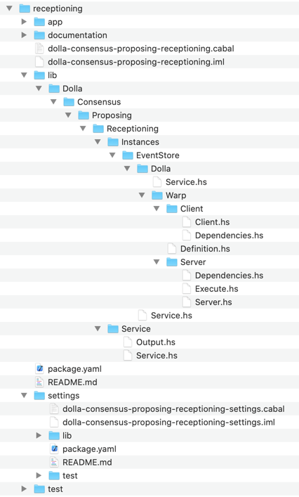

/ [Consensus](https://github.com/dolla-consortium/consensus) / [Proposing](https://github.com/dolla-consortium/consensus-proposing) / Receptioning
# Receptioning

- [Overview](#overview)
- [Project Tree](#project-tree)

# Overview

`Receptioning` collects requests from customers and consortium members

# Project Tree

### 1. Service
This is a non-deterministic service, A merge of clients requests
- Send Requests over the network via [Client.hs](library/Dolla/Consensus/Proposing/Receptioning/Execution/Environment/EventStore/Dolla/Warp/Client/Client.hs)
- Receive Request via [Server.hs](library/Dolla/Consensus/Proposing/Receptioning/Execution/Environment/EventStore/Dolla/Warp/Server/Server.hs)
- Append Non Idempotently Request directly into the Packaging Input Stream

### 2. Execution Environment
`Receptioning` is Polymorphic by
- The Log Engine used
- The Business Logic used on top of the consensus layer (requests in that context)
- The type of server used

You'll find in this folder different version of Service.hs "polymorphically reduced" and concrete
- Over the event store
  - [Service.hs](library/Dolla/Consensus/Proposing/Receptioning/Execution/Environment/EventStore/Service.hs)
  - Over Dolla Dummy Requests
    - [Service.hs](library/Dolla/Consensus/Proposing/Receptioning/Execution/Environment/EventStore/Dolla/Service.hs)
    - Over Warp using Servant library (concrete version)
      - [Client.hs](library/Dolla/Consensus/Proposing/Receptioning/Execution/Environment/EventStore/Dolla/Warp/Client/Client.hs)
      - [Server.hs](library/Dolla/Consensus/Proposing/Receptioning/Execution/Environment/EventStore/Dolla/Warp/Server/Server.hs)

### 3. Executable

`Receptioning` has some DevOps features as well

- Settings.hs always into a separated project `xxxx-receptioning-settings` for deployment purposes in Zeus
- Dependencies.hs are derived from Settings if sub-dependencies are all Healthy

[Executable.hs](executables/Executables.hs)
- Perform the HealhtChecks to obtain the pipeline dependencies
- Execute the server
- Put the Microservice back in HealthCheck mode if any Exception bubbles up in the server during execution.

**N.B** : Microservice configuration and Deployment (Locally/Simulated/Production etc...) are defined in the package [Zeus](../zeus/)
</div