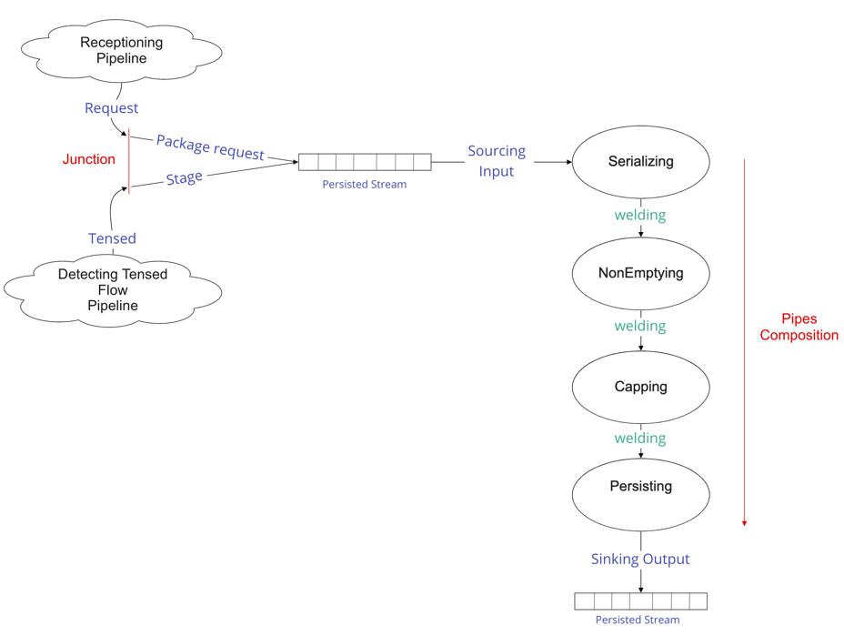
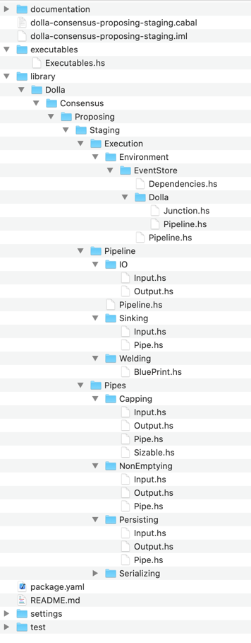
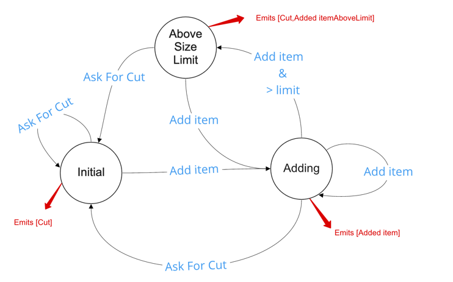

/ [Consensus](https://github.com/dolla-consortium/consensus) / [Proposing](https://github.com/dolla-consortium/consensus-proposing) / Staging
# Staging Pipeline
- [Overview](#overview)
- [Project Tree](#project-tree)
- [Pipeline](#pipeline)
  - [Junction](#junction)
  - [IOs](#ios)
    - [Input/Commands](#inputcommands)
    - [Output/Events](#outputevents)
  - [Pipe recipe](#pipe-recipe)
- [Pipes](#pipes)
  - [Serializing](#serializing)
  - [NonEmptying](#nonemptying)
  - [Capping](#capping)
  - [Persisting](#persisting)


# Overview

`Staging` pipeline is responsible for packaging and staging requests from `receptioning` into proposal files.
Each of these local proposals once accepted by the consortium will be uniformly transacted on each consortium node.
The transactions will then be appended into each node ledgers.


# Project Tree

<div>

### 1. Pipeline

`Staging` is a ***Pipeline***
- a persisted input stream : [Input.hs](library/Dolla/Consensus/Proposing/Staging/Pipeline/IO/Input.hs)
- a line of Pipes Welded together in [Pipeline.hs](library/Dolla/Consensus/Proposing/Staging/Pipeline/Pipeline.hs)
  - Sourcing initial inputs : `stream infinitely inputLog`
  - Composition of **deterministic** *Pipes*
    - Welding : Adapting IOs between pipes

  ```
  serializing .~> nonEmptying .~> capping .~> persisting 
  ```
  - Sinking final outputs : `sinking outputLog`
- a persisted output stream : [Output.hs](library/Dolla/Consensus/Proposing/Staging/Pipeline/IO/Output.hs)

### 2. Pipes
The pipeline is using **Pipes** `serializing, nonEmptying, capping, persisting`, meaning each of them has
- An Input Stream
- A Stream Processing
- An Output Stream

### 3. Execution Environment

The `Staging` model (pipeline) is executed on
- The Log Engine used
- The Business Logic used on top of the consensus layer (requests in that context)

You'll find in this folder different version of Pipeline.hs "polymorphically reduced" or concrete
- [Pipeline.hs](library/Dolla/Consensus/Proposing/Staging/Execution/Environment/EventStore/Pipeline.hs) over the event store
- [Pipeline.hs](library/Dolla/Consensus/Proposing/Staging/Execution/Environment/EventStore/Dolla/Pipeline.hs) over the event store + Dolla Dummy Requests (Concrete Version)

### 4. Executable

`Staging` has some DevOps features as well

- [Settings.hs](settings/library/Dolla/Consensus/Proposing/Staging/Execution/Environment/EventStore/Settings.hs)  always into a separated project `xxxx-packaging-settings` for deployment purposes in Zeus
- [Dependencies.hs](library/Dolla/Consensus/Proposing/Staging/Execution/Environment/EventStore/Dependencies.hs) are derived from Settings if sub-dependencies are all Healthy

[Executable.hs](executables/Executables.hs)
- Perform the HealhtChecks to obtain the pipeline dependencies
- Execute the pipeline + load the [junctions](#junction) in the EventStore Microservice
- Put the Microservice back in HealthCheck mode if any Exception bubbles up in the pipeline during execution.

**N.B** : Microservice configuration and Deployment (Locally/Simulated/Production etc...) are defined in the package [Zeus](../zeus/)
</div>

# Pipeline
## Junction

A Junction (Merger) is
   - a set of persisted input streams
   - a nondeterministic logic for merging these input streams
   - a persisted output stream (input of a pipeline)

The persisted input stream is the junction of 2 upstreams pipelines
- [Receptioning](../receptioning/README.md) providing collected requests
- [Detecting Tension](../detecting-tension/README.md) transmitting Local-Proposal-Starvation Notifications

We are using the "User Defined Projections" EventStore feature to implement this junction
 - javaScript snippets
 - loaded in the event store microservice directly
 - more details : https://eventstore.org/docs/projections/api/index.html

> Defined in [Junction.hs](library/Dolla/Consensus/Proposing/Staging/Execution/Environment/EventStore/Dolla/Junction.hs)

> Executed in [Executable.hs](executables/Executables.hs)

## IOs
### Input/Commands

> Defined in [Input.hs](library/Dolla/Consensus/Proposing/Staging/Pipeline/IO/Input.hs)

#### 1. Package request

Executing that command means
- Accumulate each request into a temporary file.

```
FileName : x.tmp with x the offset of local proposal produced
```

- Detect when the temporary file is full

```
Current Size + new request size < configurable size limit
```
- Convert this temporary file into a proposal file
```
x.tmp -> x.proposal
```
- Redirect the stream into a new Temporary File : `(x+1).tmp`
- Notify the downstream Broadcasting Section that a new local proposal is available.

#### 2. Stage

This command appears when the Local Proposal flow is **tensed**. The flow is tensed when the consensus is consuming more local proposal than produced.

Executing it means :
- Converting the temporary file into a proposal file if requests are already accumulated.

### Output/Events

> Defined [Output.hs](library/Dolla/Consensus/Proposing/Staging/Pipeline/IO/Output.hs)

Staging produces
- A Notification : `LocalProposalStaged {localOffset :: Offset}`
- a File `{localOffset}.proposal` containing requests with
```
0 < Size <= Size Limit
```
## Pipe recipe

To produce the expected pipeline output , we are combining different pipes all together by
- A simple function composition (.)
- A welding : `map` to adapt Output Pipe `x`  with Input Pipe `x+1`

The `Staging` pipe recipe is
```haskell
  stream infinitely inputLog -- sourcing
     ~> serializing
    .~> nonEmptying
    .~> capping proposalSizeLimit
    .~> persisting proposalRootFolder
    .~> sinking outputLog
```
> Defined in [Pipeline.hs](library/Dolla/Consensus/Proposing/Staging/Pipeline/Pipeline.hs)

> The welding between each pipe is defined in [/Welding/BluePrint.hs](library/Dolla/Consensus/Proposing/Staging/Pipeline/Welding/BluePrint.hs)

The pipe recipe goals are
### 1. Size properly the proposals
```
0 < Size <= Size Limit
```
Under the responsibility of
- [`NonEmptying`](#nonemptying) Pipe
- [`Capping`](#capping) Pipe

### 2. Convert the temporary file into a proposal file.
Under the responsibility of
- [`Persisting`](#persisting) Pipe

N.B : [`Serializing`](#serializing) will be removed eventually. We'll evaluate this when addressing data compression.

# Pipes
## Serializing

> Defined in [Pipe.hs](library/Dolla/Consensus/Proposing/Staging/Pipes/Serializing/Pipe.hs)

Just Transform `request` in `SerializedRequest`

```haskell
newtype SerializedRequest = SerializedRequest [Word8] deriving (Eq,Show)
```

> N.B : `serializing` will be removed eventually. We'll address it when we'll add the request compression features.

## NonEmptying

### Problem

Remembering the initial input of the section
```haskell
data Input request
  = Stage -- ^ ask to "Staging Pipeline" to force the stage of a new local proposal with all the requests currently collected
  | Package request -- ^ ask to to "Staging Pipeline" to package the request into a proposal according
                    -- some properties (see README.md)

```
It's totally natural to receive multiple `Stage` commands consecutively, E.g
- No Requests while many blocks are appended consecutively
- Etc...

Forcing the production of empty proposal adds no value in our domain and provokes an accidental complexity downstream if not managed.  
Therefore, we want to
- Remove the consecutive `Stage` commands from our input stream.
- Never start downstream processing with a `Stage`

Said differently, we want to get the following property
```
0 < Proposal File Size 
```

### Approach

With the following Natural Transformation
``` haskell
Staging.Input request ~> Maybe request
```
We want the following stream property
- Never start by `Nothing`
- Never 2 consecutive `Nothing`

E.g - We want the following transformation
``` haskell
[Nothing, Just r1, Just r2, Nothing, Nothing, Nothing] -> [Just r1, Just r2, Nothing]
```
> Implemented in [Pipe.hs](library/Dolla/Consensus/Proposing/Staging/Pipes/NonEmptying/Pipe.hs)

> Tested in [PipeSpec.hs](test/Dolla/Consensus/Proposing/Staging/Pipes/NonEmptying/PipeSpec.hs)

## Capping

### Problem

We can't broadcast proposal files with unlimited memory size. We want the following property

```
Proposal File Size <= Size Limit
```

`Capping` is welded after `NonEmptying`, combining the 2 pipes will give the following property
```
0 < Proposal File Size <= Size Limit
```


### Approach

To increase the expressivity of our previous domain we are doing the following natural transformation
```haskell
instance Weldable (NonEmptying.Output request) (Capping.Input request) where
  weld
    = \case
      Nothing  -> Capping.AskForACut
      Just request -> Capping.Add request
```
With the Following Output in [Output.hs](library/Dolla/Consensus/Proposing/Staging/Pipes/Capping/Output.hs)
```haskell
data Output request
  = Cut
  | Added request
  deriving (Show,Eq)
```
the polymorphism on `request` is reduced with the following type Class

```haskell
class Sizable a where
  getMemorySize :: a -> Byte
  
capping
  :: ( S.MonadAsync m
     , Sizable item)
  => Byte -- ^ proposalSizeLimit
  -> S.SerialT m (Input item)
  -> S.SerialT m (Output item)
````
We are cutting the consecutiveness of `Added request` events if the cumulative memory size of requests is > a size limit given.
By "cutting", we mean adding a `Cut` in between 2 `Added request` events.

Using a `Fold executed with a postscan` with the following State Machine



> Implemented in [Pipe.hs](library/Dolla/Consensus/Proposing/Staging/Pipes/Capping/Pipe.hs)

> Tested in [PipeSpec.hs](test/Dolla/Consensus/Proposing/Staging/Pipes/Capping/PipeSpec.hs)

## Persisting

### Prerequesites
This pipe prerequesites the following properties on its stream input
```
0 < Proposal File Size <= Size Limit
```
### Input/Output
```haskell
data Input request
  = CommitProposal
  | Persist request
  deriving (Show,Eq,Functor)
  
newtype Output 
  = LocalProposalPersisted {proposalId :: Offset} 
  deriving (Show,Eq)
```
### Processing

Using Streamly FileSystem primitives

- Create a temporary file : `x.tmp`
- Persist request
- When receiving `CommitProposal`
  - Convert `x.tmp` into `x.proposal`
  - produce `LocalProposalPersisted x`
  - `x = x + 1`

> Implemented in [Pipe.hs](library/Dolla/Consensus/Proposing/Staging/Pipes/Persisting/Pipe.hs)

> Integration Test in [PipeSpec.hs](test/Dolla/Consensus/Proposing/Staging/Pipes/Persisting/PipeSpec.hs)
